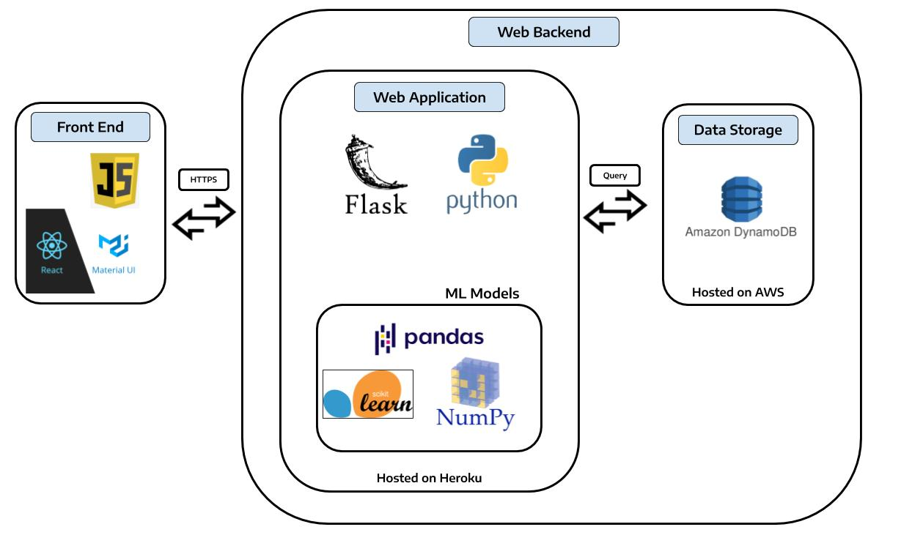

# Cyberity App

Cyberity aims to provide a safer work environment for companies and prevent insider threats. This is a web application to analyze user behavior via logs and idenetify insider threats.

This repository is intended for application development purposes

## Main page

The official cyberity repository can be found: https://github.com/dcsil/Cyberity

Table of Contents
---
- [Architecture](#architecture)
- [Getting Started](#getting-started)
  - [App Prerequisites](#app-prerequisites)
  - [Installation](#installation)
  - [Run in Development Mode Locally](#run-in-development-mode-locally)
  - [Run in Production Mode Locally](#run-in-production-mode-locally)
  - [Mongodb Atlas Integration](#mongodb-atlas-integration)
- [Deployment](#deployment)
- [Tech Stack](#tech-stack)

## Architecture

## Getting Started

### App Prerequisites

* Linux or Unix distribution

### Installation

1. run `source run bootstrap`

### Run in Development Mode Locally
In development mode, both react and flask will be running seperatly in development mode.
It will create and use a local mongodb.

1. run `source run dev server` in root directory
2. run `source run dev client` in root directory

### Run in Production Mode Locally
In production mode, react is built and served from the flask back end. Flask will also be running on production mode.
It will create and use a local mongodb.

1. run `source run prod` in root directory

### Mongodb Atlas Integration
If you would like to use a cloud database instead of running your database locally, follow these instructions.
1. Create a mongodb atlas account. Free tier works as well
2. Once you log in, create a cluster
3. Open the "connect" dialog and create a MongoDB User step of the dialog, enter a Username and a Password for your database user. 
5. Open the "connect" dialog and then "connect to your application" option. Now set the driver as python and version as 3.4. Then modify and save the connection-string/URI somehere as per instructions.
6. If your running locally, on your system `export MONGO_URI=<Mongodb uri. NOT mongodb+srv uri>`

Full instructions can be found here: https://docs.atlas.mongodb.com/getting-started/
## Deployment

Follow these instructions if you want to deploy this on heroku.

1. Fork this repo
2. Make a heroku account if you don't already have one. This project works with free tier accounts as well.
3. "Create new app" in the heroku dashboard or heroku CLI.
4. [Setup mongodb atlas](#mongodb-atlas-integration)
5. Go to your app settings in heroku dashboard, and under settings, set these 2 config vars:
  * FLASK_ENV=production
  * MONGO_URI=<Mongodb uri. NOT mongodb+srv uri>
6. Follow these instructions to integrate with your forked repo: https://devcenter.heroku.com/articles/github-integration#enabling-github-integration

## Tech Stack

Our tech stack can be found here: https://stackshare.io/dcsil/cyberity
