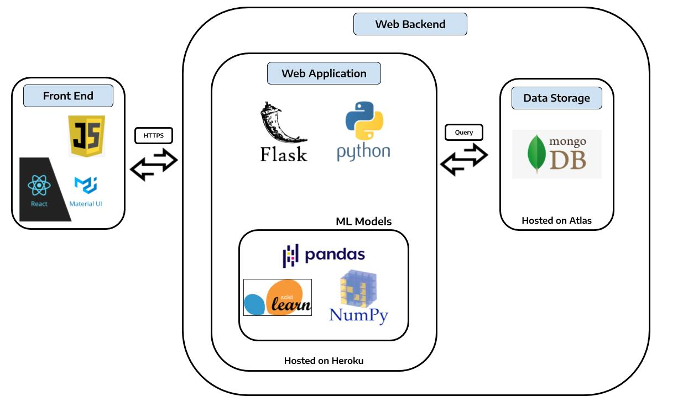
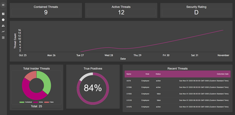
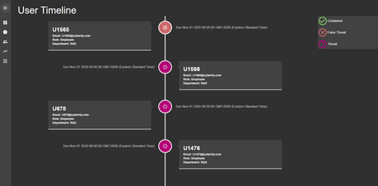
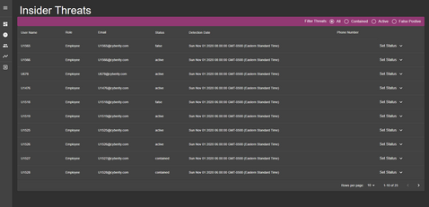
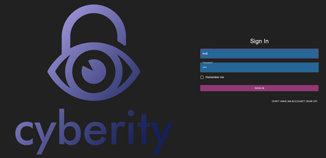

# Cyberity App

Cyberity aims to provide a safer work environment for companies and prevent insider threats. This is a web application to analyze user behavior via logs and identify insider threats.

This repository is intended for application development purposes

## Webapp

The web application can be found: [Cyberity Application](https://cyberity.herokuapp.com/)

## Main page

The official cyberity repository can be found: [Cyberity Repo](https://github.com/dcsil/Cyberity)

Table of Contents
---
- [Architecture](#architecture)
- [Getting Started](#getting-started)
  - [App Prerequisites](#app-prerequisites)
  - [Installation](#installation)
  - [Run in Development Mode Locally](#run-in-development-mode-locally)
  - [Run in Production Mode Locally](#run-in-production-mode-locally)
  - [Mongodb Atlas Integration](#mongodb-atlas-integration)
- [Deployment](#deployment)
- [Tech Stack](#tech-stack)
- [Application Demo](#application-demo)
- [Design & Accessibility](#design-and-accessibility)

## Architecture

## Getting Started

### App Prerequisites

* Linux or Unix distribution

### Installation

1. run `source run bootstrap`

### Run in Development Mode Locally
In development mode, both react and flask will be running seperatly in development mode.
It will create and use a local mongodb.

1. run `source run dev server` in root directory
2. run `source run dev client` in root directory

### Run in Production Mode Locally
In production mode, react is built and served from the flask back end. Flask will also be running on production mode.
It will create and use a local mongodb.

1. run `source run prod` in root directory

### Mongodb Atlas Integration
If you would like to use a cloud database instead of running your database locally, follow these instructions.
1. Create a mongodb atlas account. Free tier works as well
2. Once you log in, create a cluster
3. Open the "connect" dialog and create a MongoDB User step of the dialog, enter a Username and a Password for your database user. 
5. Open the "connect" dialog and then "connect to your application" option. Now set the driver as python and version as 3.4. Then modify and save the connection-string/URI somehere as per instructions.
6. If your running locally, on your system `export MONGO_URI=<Mongodb uri. NOT mongodb+srv uri>`

Full instructions can be found [here](https://docs.atlas.mongodb.com/getting-started/)
## Deployment

Follow these instructions if you want to deploy this on heroku.

1. Fork this repo
2. Make a heroku account if you don't already have one. This project works with free tier accounts as well.
3. "Create new app" in the heroku dashboard or heroku CLI.
4. [Setup mongodb atlas](#mongodb-atlas-integration)
5. Go to your app settings in heroku dashboard, and under settings, set these 2 config vars:
  * FLASK_ENV=production
  * MONGO_URI=<Mongodb uri. NOT mongodb+srv uri>
6. Follow [these instructions](https://devcenter.heroku.com/articles/github-integration#enabling-github-integration) to integrate with your forked repo:

## Tech Stack

Our tech stack can be found here: [Cyberity Stackshare](https://stackshare.io/dcsil/cyberity)

## Application Demo

### Video
Our demo video can be found [here](https://youtu.be/QVc4tKU43Jg)

### Screenshots
 
 

### Features/Pages
* Login/Signup Pages
* Dashboard
  * This is the main page to give analysts an overview of current and recent threat information/statistics
  * Currently data is being automatically fetched every 10 minutes which is customizable based on client needs/limitations
  * We went for a minimalistic design based on our user research feedback
* Insider Threats Page
  * Lists detected threats by user and datetime
  * Ability to filter threats by active/contained/false
  * Ability for analysts to set a threats status after performing an investigation
* User Page
  * Lists all the employees of the company
  * Each user features a drop-drown menu to show additional user profile info
  * This user information can be customized to display any user information the client requests
* Threat Timeline
  * Displays all threats in a linear timeline fashion
  * Displays each threat user info, detection date and current status
* Backend Data Processing
  * We are using an ML autoencoder model to detect threats
  * We are using the authorization and process logs to train and apply our model
  * Our model was trained locally and uploaded to our server (Cyberity-App/server/ml/trained_model.sav)
  * For demo purposes we only have a few hours worth of the logs processed on the server
  * We preprocess the log data which and upload to the server (our demo data is contained in Cyberity-App/server/ml/data.sav)
  * We have an api method (POST /api/processLogs) which is used to run the preprocessed data through our model on a seperate server thread and add any new threats to the database
  * In a real use case we need to grab and preprocess the clients log data then run our model on a periodic schedule (hourly, daily, etc.)

## Design and Accessibility
Adheres to Web accessibility for developers: [WCAG-checklist](https://www.wuhcag.com/wcag-checklist/)

### Guideline | Summary | Description of how we accommodated this
- [x] Non-text Content | Provide text alternatives for non-text content | We have different visuals to convey data in addition to test. For example: charts, timelines, lists, progress bars.
- [x] Audio-only and Video-only (Pre-recorded) | Provide an alternative to video-only and audio-only content | We do not have video-only or audio-only content. By default, we pass this check.
- [x] Captions (Pre-recorded) | Provide captions for videos with audio | We do not have video or audio content. By default, we pass this check.
- [x] Audio Description or Media Alternative (Pre-recorded) | Video with audio has a second alternative | We do not have video or audio content. By default, we pass this check.
- [x] Info and Relationships | Logical structure | Info and data is laid out in a clear, concise manner with tables, charts, headings, and clear formatting choices. We use separate pages for specific content and the dashboard to clearly compress and showcase the data.
- [x] Meaningful Sequence | Present content in a meaningful order | Our content starts off in the dashboard that showcases the most important data for the user. We then branch of the other pages if the user wants specific data/content. The dashboard displays data from the most important to the least important.
- [x] Sensory Characteristics | Use more than one sense for instructions | Different visuals like shadows, color changes, and movement allow the user to find out what and what they cannot click on. 
- [x] Use of Color | Do not use presentation that relies solely on color | Our data is displayed through timelines, charts, lists, and progress bars. We data that is displayed via text and color.
- [x] Audio Control | Do not play audio automatically | We do not have audio content. By default, we pass this check.
- [x] Keyboard | Accessible by keyboard only | Everything is easily accessible with keyboard due to the navbar on the left.
- [x] No Keyboard Trap | Do not trap keyboard users | Keyboard users have full access to everything due to the navbar on left. Keyboard users will not get trapped within the dashboard or pages.
- [x] Timing Adjustable | Time limits have user controls | We do not have time limits. By default, we pass this check.
- [x] Pause, Stop, hide | Provide user controls for moving content | The timeline and charts allows the users to traverse the data by scrolling or moving with the mouse. However, there is no blinking, automated moving, or automated scrolling content. The user has full access to how they want to display the data.
- [x] Three Flashes or Below | No content flashes more than three times per second | Our web app gets data from the server every 10 minutes, thus changing the visuals every 10 minutes to account for new data.
- [x] Bypass Blocks | Provide a ‘Skip to Content’ link | All data is displayed on 1 with a navbar that allows easy navigation. Users can also search and query to get their data.
- [x] Page Titled | Use helpful and clear page titles | Each page and dashboard widget are properly labeled.
- [x] Focus Order | Logical order | Users can navigate to every part of the website using the 'Tab' key as well the mouse. When the user logs in they are redirected to the dashboard where they can choose to navigate to other pages.
- [x] Link Purpose (In Context) | Every link’s purpose is clear from its context | We do not have hyperlinks. By default, we pass this check.
- [x] Language of Page | Page has a language assigned | It is assigned to English by default
- [x] On Focus | Elements do not change when they receive focus | Links/Pages/Content are accessed when they are submitted via the enter key or clicked with the mouse. Users can easily navigate with mouse-only or keyboard-only.
- [x] On Input | Elements do not change when they receive input | Submitting data will only process when the user clicks a submit button or presses enter. List data will display content as the user queries data in the text field.
- [x] Error Identification | Clearly identify input errors | Alerts(providing error feedback) occur when the user provides incorrect/incomplete data.
- [x] Labels or Instructions | Label elements and give instructions | Data/Elements are clearly labeled in Pages, Dashboard widgets, and charts. Icons are clearly defined in the timeline.
- [x] Parsing | No major code errors | We have good structures for our components. Everything is nested properly or side-by sad. Limiting use of attributes to limit duplicates. We pass code climate and lighthouse scores.
- [x] Colour Part II | [Colours are chosen in a way that won't make things difficult for colour blind users](https://venngage.com/blog/color-blind-friendly-palette/) | Our website passes lighthouse accessbility test with the lowest being 98%. Our color scheme adheres to the color blind friendly palette by using Magenta, Dark Grey, and Green as our primary colors.
